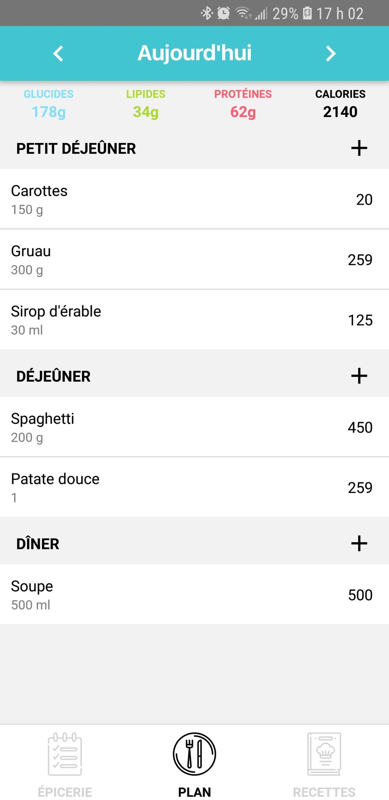
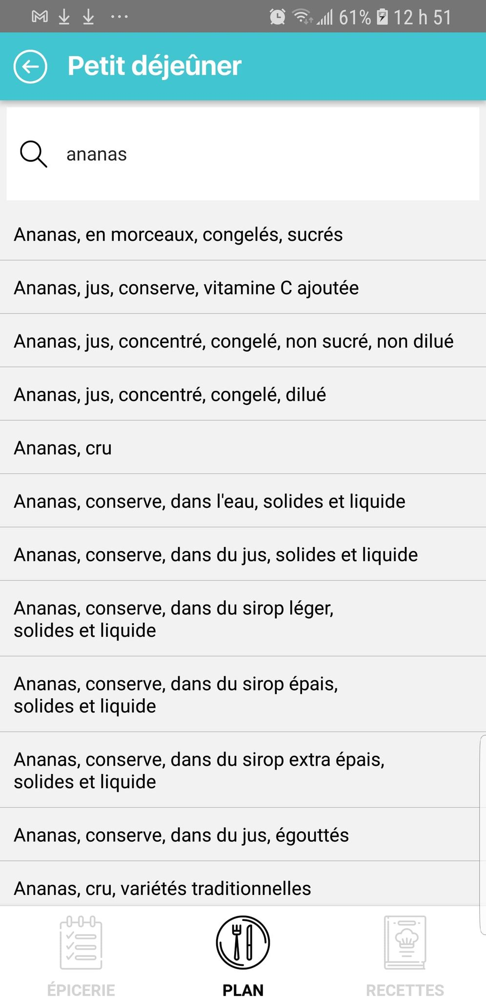

# Le bol de riz

Application mobile permettant aux utilisateurs de suivre leur apport alimentaire quotidien, de générer automatiquement une liste d’épicerie et de créer des recettes.

## Visuels
<div>



</div>

## Statut du projet

Le projet en cours de développement.

#### Liste des fonctionnalités implémentées:
- Création de compte

##### Liste d'épicerie:
- Création et supression de liste d'épicerie
- Ajout d'item dans la liste d'épicerie
- Marquer d'un trait les items de la liste d'épicerie

##### Planificateur:
- Ajout d'item 

##### Recettes:
- Interface utilisateur implémentée 

#### Liste des fonctionnalités futures:

##### Liste d'épicerie:
- Amélioration de la barre de recherche des items d'épicerie (retrait des caractéristiques superflues et meilleure de la catégorisation des articles)
- Suppression d'items dans une liste
- Possibilité d'ajouter automatiquement les articles provenant du planificateur dans une liste d'épicerie

##### Planificateur:
- Ajout de tableau des micronutriments
- Ajout de dates pour chaque page du planificateur, de sorte à pouvoir retourner voir les jours précédents et futures
- Possibilité de cloner une page de journal alimentaire d'une journée antérieure

##### Recettes:
- Sauvegarde de recettes dans la base de données

## Pour commencer

These instructions will get you a copy of the project up and running on your local machine for development and testing purposes. See deployment for notes on how to deploy the project on a live system.

### Prerequisites

What things you need to install the software and how to install them

```
Give examples
```

### Installing

A step by step series of examples that tell you how to get a development env running

Say what the step will be

```
Give the example
```

And repeat

```
until finished
```

End with an example of getting some data out of the system or using it for a little demo

```
Give an example
```

```

## Built With

* [Dropwizard](http://www.dropwizard.io/1.0.2/docs/) - The web framework used
* [Maven](https://maven.apache.org/) - Dependency Management
* [ROME](https://rometools.github.io/rome/) - Used to generate RSS Feeds

## Auteurs

* **Élisa Correia-Martins**

## License

This project is licensed under the MIT License - see the [LICENSE.md](LICENSE.md) file for details

## Acknowledgments

* Hat tip to anyone whose code was used
* Inspiration
* etc
